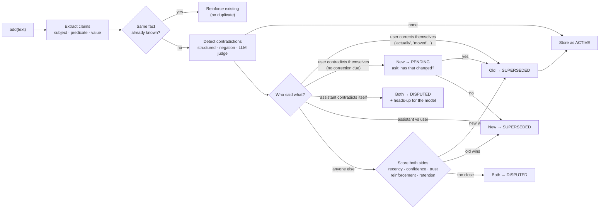
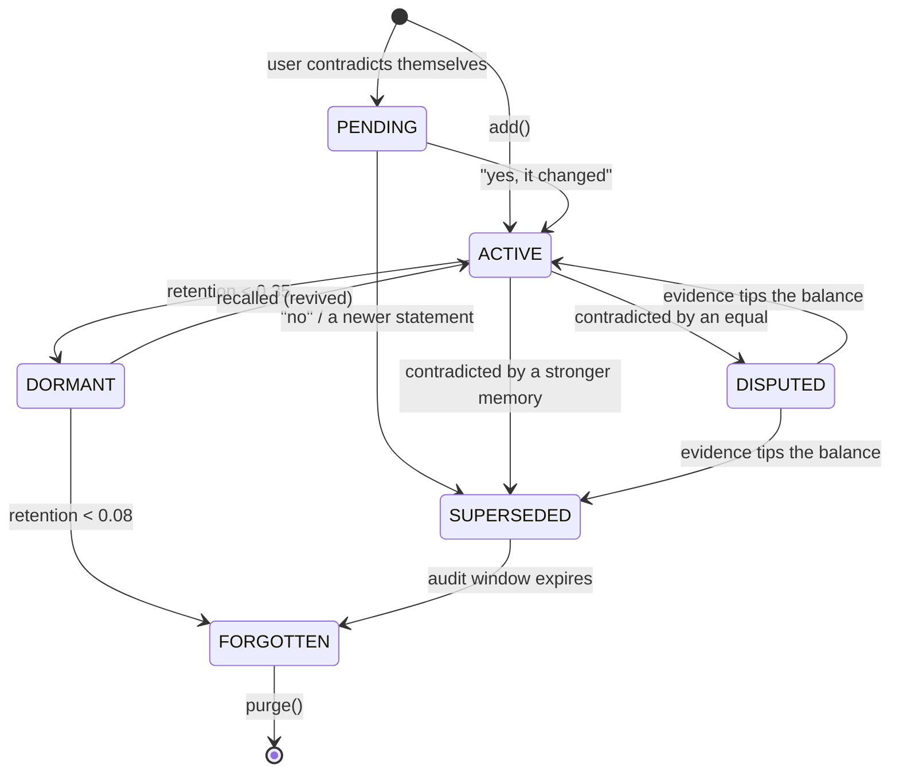
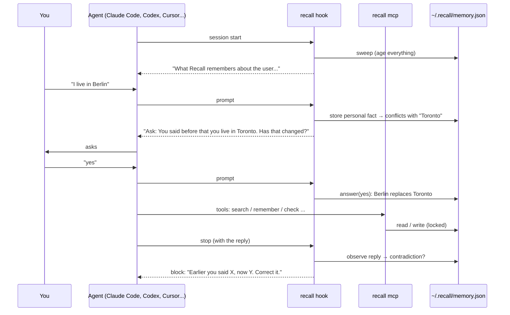

<p align="center">
  
</p>

<p align="center">
  <a href="#install"></a>
  
  <a href="https://github.com/unseenanomaly/recall/actions/workflows/ci.yml"></a>
  <a href="#use-it-in-your-ai-tools"></a>
  
  <a href="LICENSE"></a>
</p>

<h3 align="center">Most AI memory only ever grows. Recall decides what to keep.</h3>

<p align="center">
  It <b>ages</b> information on a forgetting curve, <b>asks before it overwrites</b> anything you told it,<br>
  <b>catches contradictions</b> (including the AI contradicting <i>itself</i>), and <b>curates</b> what your model should believe right now.<br>
  One memory, shared by Claude Code, Codex, Gemini, Cursor, Copilot and nine more.
</p>

<p align="center">
  <a href="#install">Install</a> ·
  <a href="#see-it-work">Demo</a> ·
  <a href="#use-it-in-your-ai-tools">AI tools</a> ·
  <a href="#commands">Commands</a> ·
  <a href="#has-that-changed">"Has that changed?"</a> ·
  <a href="#when-the-ai-contradicts-itself">Self-contradictions</a> ·
  <a href="#how-it-works">How it works</a> ·
  <a href="#python-api">API</a> ·
  <a href="docs/UNINSTALL.md">Uninstall</a>
</p>

---

## Why Recall

Vector-store "memory" is an append-only pile. A year in, your assistant confidently believes you
**live in Toronto** *and* **live in Berlin**, still remembers a grocery reminder from March, treats a
random web scrape as gospel, and happily tells you the database port is 5432 an hour after it told
you 6543.

Humans don't work like that. We forget on purpose: unused things fade, rehearsed things stick, and
when someone contradicts what they told us before, we *ask*. Recall gives your agents the same hygiene.

|  | Append-only memory | **Recall** |
|---|---|---|
| Old facts | Live forever | Decay on a per-kind forgetting curve |
| "I live in Toronto" … later "I live in Berlin" | Both retrieved, model guesses | **Asks you:** *"You said before that you live in Toronto. Has that changed?"* (or auto-yes, your choice) |
| "Actually, I moved to Berlin" | Both retrieved | Old belief **superseded** at once, with an audit trail |
| A web page says you live in Paris | Last write wins | Newcomer **rejected**: a weak source can't overrule you |
| The AI said port 5432, now says 6543 | Nobody notices | **Flagged**; the model is told to correct itself |
| The AI says "since you live in Toronto…" after you moved | Nobody notices | **Caught**, and the AI can never overwrite what you said |
| Used often | Same as never used | Gets stronger every time it's recalled |
| "What should the LLM see?" | Top-k by similarity | Current, trusted, relevant, **inside a token budget** |
| "Why does it believe that?" | ¯\\_(ツ)_/¯ | `recall explain <id>` shows the full history |
| Which tools? | One | **14 agents share one memory**: tell Claude Code you moved, and Codex knows tomorrow |

## Install

Two steps: put the `recall` command on your machine, then add it to your tools.

**1. The `recall` command** (Python 3.9+, zero dependencies)

```bash
pipx install git+https://github.com/unseenanomaly/recall
```

`uv tool install git+https://github.com/unseenanomaly/recall` works too. Run `pipx ensurepath` once so
desktop apps (Claude, Cursor, Codex…) can find it. Every plugin below calls this command, the same
way other plugins need Node on your PATH.

**2. Your tools.** Each one installs straight from this repo with its own plugin system:

| Tool | Install |
|---|---|
| **Claude Code** | `/plugin marketplace add unseenanomaly/recall` then `/plugin install recall@recall` |
| **OpenAI Codex** | `codex plugin marketplace add unseenanomaly/recall` then `codex plugin add recall@recall` |
| **GitHub Copilot CLI** | `copilot plugin marketplace add unseenanomaly/recall` then `copilot plugin install recall@recall` |
| **Gemini CLI** | `gemini extensions install https://github.com/unseenanomaly/recall` |
| **Antigravity CLI** | `agy plugin install https://github.com/unseenanomaly/recall` |
| **Devin CLI** | `devin plugins install unseenanomaly/recall` |
| **Grok Build** | `grok plugin install unseenanomaly/recall --trust` |
| **Hermes Agent** | `hermes plugins install unseenanomaly/recall --enable` |
| **Pi** | `pi install git:github.com/unseenanomaly/recall` |
| **Swival** | `swival skills add --global https://github.com/unseenanomaly/recall` |
| **OpenCode** | `recall install opencode` |
| **Cursor** | `recall install cursor` |
| **Gemini Code Assist** | `recall install gemini` |
| **OpenClaw** | `recall install openclaw` |

**Or all at once:** `recall install --detected` connects every tool it finds on this machine,
writing the same pieces directly into each tool's config. It's also how you get automatic hooks
in Gemini CLI and Devin, whose plugin installers don't carry them. `recall agents` shows what's
connected, `recall doctor` checks the setup, and [`recall uninstall`](docs/UNINSTALL.md) takes it all out again.

<details>
<summary><b>From a clone / for development</b></summary>

```bash
git clone https://github.com/unseenanomaly/recall && cd recall
pip install -e ".[dev]"      # zero runtime dependencies; pytest for development
pytest
recall demo
```
</details>

## See it work

```bash
recall demo
```

A 16-month story plays out on a simulated clock. Highlights, straight from the real output:

```text
━━ Day 120: the user changes their mind ━━━━━━━━━━━━━━━━━━━━━━━━━━
 2025-05-06  + “I moved to Berlin”
              ├ claim    user.lives_in = Berlin
              └ ⟳ SUPERSEDES old belief «Lives in Toronto»
                new memory won on recency + explicit correction (1.10 vs 0.62)
 2025-05-06  + “My favorite editor is VS Code”
              ├ claim    user.favorite_editor = VS Code
              └ ? ASKS FIRST You said before that your favorite editor is vim (2025-01-06). Has that changed?
 2025-05-06  ↳ user: “yes”  →  ✓ confirmed «My favorite editor is vim» replaced
              (with confirm=auto, `recall auto on`, it would have been accepted without asking)

━━ Day 130: an untrustworthy source tries to rewrite history ━━━━━
 2025-05-16  + “I live in Paris” via web
              └ 🛡 REJECTED, old belief holds «I moved to Berlin»
                old memory won on explicit correction + source trust (0.64 vs 0.99)

━━ Day 150: the assistant contradicts itself ━━━━━━━━━━━━━━━━━━━━━
 2025-06-05  ✦ assistant: “The staging database port is 5432.”
              └ consistent; its claims are kept to check later replies against
 2025-06-05  ✦ assistant: “The staging database port is 6543.”
              └ ⚠ SELF-CONTRADICTION
                Earlier (2025-06-05) you said "The staging database port is 5432", but just now
                you said "The staging database port is 6543". Those contradict each other.
 2025-06-05  ✦ assistant: “You live in Toronto, so the 9am standup is early for you.”
              └ ⚠ CONTRADICTS THE USER
                You said "You live in Toronto, ...", but on 2025-05-06 the user told you: "I moved to Berlin".
 2025-06-05  ✦ assistant: “Correction: the staging database port is 5432.”
              └ ✓ it said which one was right, so the dispute is settled
```

…and a year of silence later, the stale and never-used facts have faded, the pinned allergy hasn't,
and Berlin is still at 86% because it kept being *used*. Full output: [`docs/demo-output.txt`](docs/demo-output.txt).

---

## Use it in your AI tools

| Tool | MCP tools | Automatic hooks | Commands |
|---|:-:|:-:|---|
| **Claude Code** | ✅ | ✅ start · prompt · stop | `/recall:recall-remember` … |
| **OpenAI Codex** (CLI + app) | ✅ | ✅ start · prompt · stop | `$recall-remember` … |
| **GitHub Copilot CLI** | ✅ | ✅ start · prompt · stop | `/recall:recall-remember` … |
| **Gemini CLI** | ✅ | ✅ with `recall install gemini-cli` | `/recall-remember` … |
| **Antigravity CLI** | ✅ | ✅ stop, with `recall install antigravity` | `/recall-remember` … |
| **Devin CLI** | ✅ | ✅ with `recall install devin` | `/recall:recall-remember` … |
| **Grok Build** | ✅ | ✅ start · prompt · stop | `/recall-remember` … |
| **Hermes Agent** | optional | ✅ every turn (plugin) | `/recall-remember` … |
| **Pi** | — | ✅ every turn (extension) | `/recall-remember` … |
| **Swival** | ✅ with `recall install swival` | — | `$recall-remember` … |
| **OpenCode** | ✅ | ✅ every turn (plugin) | `/recall-remember` … |
| **Cursor** (IDE + `cursor-agent`) | ✅ | ✅ start · prompt · reply · stop | `/recall-remember` … |
| **Gemini Code Assist** (IDE agent) | ✅ | — | ask in chat |
| **OpenClaw** | ✅ | ✅ every turn (plugin) | `/recall-remember` … |

**What the pieces do**

- **MCP tools** (`remember`, `search`, `context`, `answer`, `check`, `forget`, `explain`, `settings`) let the
  model read and write memory itself. The server is built in (`recall mcp`), no dependencies.
- **Hooks** make it automatic. At session start the agent is told what Recall believes about you; when
  you send a prompt, personal facts in it are remembered, a pending *"has that changed?"* question
  is put to you, and a plain "yes"/"no" reply is recorded; when the agent finishes, its reply is
  checked for contradictions and, if it contradicted itself or you, it's asked to fix that.
- **Commands** let *you* drive it: remember, search, forget, show, auto-yes on/off, check. In most
  tools they're skills, so the same files work everywhere.
- **The `recall` skill** teaches the model when and how to use Recall, even without hooks.

> Every tool shares one memory file, `~/.recall/memory.json`, so something you tell Claude Code is
> known to Codex tomorrow. Run `recall init` inside a project to give that project its own memory
> instead (see [Where your data lives](#where-your-data-lives)).

### Per-tool setup

Each tool has two routes. **From GitHub** uses the tool's own plugin system: you get updates
through it and remove it with its own uninstall command. **`recall install <tool>`** writes the same
pieces straight into the tool's config (merging into existing files, backing each one up once as
`<file>.recall-backup`, refusing to rewrite files that contain comments). It also fills the gaps
where a tool's plugin format can't carry hooks. Paths are for macOS/Linux; on Windows `~` is
`%USERPROFILE%`.

<details>
<summary><b>Claude Code</b>: MCP, hooks and <code>/recall:recall-*</code> skills</summary>

**From GitHub** (send these as two separate prompts; in the desktop app's Code tab you can also use
**+ → Plugins → Add plugin**):

```text
/plugin marketplace add unseenanomaly/recall
/plugin install recall@recall
```

**Or:** `recall install claude-code` saves the same plugin to `~/.claude/skills/recall/`.

The plugin registers the `recall` MCP server (`.mcp.json`), three hooks (`SessionStart`,
`UserPromptSubmit`, `Stop` in `hooks/claude-codex.json`) and seven skills: `/recall:recall` plus
`/recall:recall-remember`, `-search`, `-forget`, `-show`, `-auto`, `-check`.

**Check:** `/plugin` lists `recall`, `/mcp` shows the server, `/hooks` shows three Recall hooks.
</details>

<details>
<summary><b>OpenAI Codex</b> (CLI and desktop app): MCP, hooks and <code>$recall-*</code> skills</summary>

**From GitHub:**

```bash
codex plugin marketplace add unseenanomaly/recall
codex plugin add recall@recall
```

Then run `codex`, open `/hooks`, review and **trust** the three Recall hooks, and start a new thread.
The desktop app picks the plugin up after a restart. Skills are invoked with `$`: `$recall-remember`,
`$recall-show`… (or pick them from `/skills`).

**Or:** `recall install codex` adds a fenced `[mcp_servers.recall]` block to `~/.codex/config.toml`,
the hooks to `~/.codex/hooks.json` and the skills to `~/.agents/skills/` (honours `CODEX_HOME`).
On Codex versions where hooks are still behind a flag, also add `[features] codex_hooks = true`.
</details>

<details>
<summary><b>GitHub Copilot CLI</b>: MCP, hooks and <code>/recall:recall-*</code> skills</summary>

**From GitHub:**

```bash
copilot plugin marketplace add unseenanomaly/recall
copilot plugin install recall@recall
```

(Inside an interactive session: `/plugin marketplace add …` and `/plugin install …`.) Copilot
namespaces plugin commands by plugin name: `/recall:recall-remember`, `/recall:recall-show`…
The hooks (`sessionStart`, `userPromptSubmitted`, `agentStop`) skip themselves quietly if `recall`
isn't on your PATH. If `/mcp` doesn't list `recall` afterwards, add it with `/mcp add` (command
`recall`, argument `mcp`).

**Or:** `recall install copilot` writes `~/.copilot/mcp-config.json`, `~/.copilot/hooks/recall.json`
and `~/.copilot/skills/` (honours `COPILOT_HOME`). Those personal skills aren't slash commands, so
just ask: *"recall, remember that I use pnpm"*.
</details>

<details>
<summary><b>Gemini CLI</b>: MCP, context and <code>/recall-*</code> commands</summary>

**From GitHub:**

```bash
gemini extensions install https://github.com/unseenanomaly/recall
```

Loads `AGENTS.md` as always-on context, registers the `recall` MCP server, and adds `/recall-remember`,
`/recall-search`, `/recall-forget`, `/recall-show`, `/recall-auto`, `/recall-check`.

**For automatic hooks too:** `recall install gemini-cli` installs the extension to
`~/.gemini/extensions/recall/` *with* `SessionStart` / `BeforeAgent` / `AfterAgent` hooks. (The GitHub
extension leaves them out on purpose: Gemini auto-loads `hooks/hooks.json`, and this repo's hook
files are written for Claude Code, Codex and Copilot.) Uninstall the GitHub copy first so you
don't have two.

**Check:** `gemini extensions list`, then `/mcp` (and `/hooks`) inside Gemini CLI.
</details>

<details>
<summary><b>Antigravity CLI</b> (<code>agy</code>): MCP, context and <code>/recall-*</code> skills</summary>

**From GitHub:**

```bash
agy plugin install https://github.com/unseenanomaly/recall
```

Antigravity reuses the Gemini extension manifest. One difference: it turns the commands into skills,
so you type them as a message (`/recall-remember I moved to Berlin`) instead of picking them from a
slash menu.

**Or:** `recall install antigravity` writes a plugin to `~/.gemini/config/plugins/recall/` that also has
a `Stop` hook to check replies for contradictions.
</details>

<details>
<summary><b>Devin CLI</b>: MCP and <code>/recall:recall-*</code> skills</summary>

**From GitHub:**

```bash
devin plugins install unseenanomaly/recall
```

Skills arrive as `/recall:recall-remember`, `/recall:recall-show`…, and the MCP server comes from
`.mcp.json`.

**For automatic hooks too:** `recall install devin` writes `~/.config/devin/mcp_config.json`, the
`SessionStart` / `UserPromptSubmit` / `Stop` hooks in `~/.config/devin/config.json`, and the skills
(`/recall-remember`…) to `~/.config/devin/skills/` (`%APPDATA%\devin\` on Windows).
</details>

<details>
<summary><b>Grok Build</b>: MCP, hooks and <code>/recall-*</code> skills</summary>

**From GitHub:**

```bash
grok plugin install unseenanomaly/recall --trust
```

Plugins start disabled: enable it in `/plugins` (Space on `recall`) or in `~/.grok/config.toml`:

```toml
[plugins]
enabled = ["recall"]
```

Start a new session (or reload plugins). Skills show as `/recall-remember`, `/recall-show`…;
verify with `grok inspect`.

**Or:** `recall install grok` writes a `[mcp_servers.recall]` block to `~/.grok/config.toml`,
`~/.grok/hooks/recall.json`, and the skills to `~/.grok/skills/` (honours `GROK_HOME`).
</details>

<details>
<summary><b>Hermes Agent</b>: plugin that runs every turn, commands, skills</summary>

**From GitHub:**

```bash
hermes plugins install unseenanomaly/recall --enable
```

Restart Hermes afterwards. The plugin adds what Recall remembers before each turn (`pre_llm_call`),
checks replies (`post_llm_call`), registers the skills as `recall:<skill>`, and adds commands that run
instantly: `/recall-remember`, `/recall-search`, `/recall-forget`, `/recall-show`, `/recall-auto`,
`/recall-answer`. Installed this way it doesn't even need step 1: if `recall` isn't on your PATH it
runs the copy bundled in the plugin.

**Or:** `recall install hermes` writes the same plugin to `~/.hermes/plugins/recall/` (honours
`HERMES_HOME`). **Optional MCP tools:** add this to `~/.hermes/config.yaml`, then `/reload-mcp`:

```yaml
mcp_servers:
  recall:
    command: "recall"
    args: ["mcp"]
```
</details>

<details>
<summary><b>Pi</b>: extension that runs every turn, plus <code>/recall-*</code> commands</summary>

**From GitHub:**

```bash
pi install git:github.com/unseenanomaly/recall
```

Pi deliberately has no MCP, so the extension does everything: before each turn it adds what Recall
remembers (and any question) to the system prompt, after each turn it checks the reply, and it adds
commands that run instantly: `/recall-remember`, `/recall-search`, `/recall-forget`, `/recall-show`,
`/recall-auto`, `/recall-answer`, `/recall-check`.

**Or:** `recall install pi` writes `~/.pi/agent/extensions/recall.ts`; or try it for one session with
`pi --extension ./integrations/pi/recall.ts` from a clone.
</details>

<details>
<summary><b>Swival</b>: <code>$recall-*</code> skills, plus MCP and <code>!recall-*</code> commands</summary>

**From GitHub:** stage the collection in your library, then activate it:

```bash
swival skills add --global https://github.com/unseenanomaly/recall
swival skills add --global recall
```

Use a `$` prefix to activate a skill explicitly: `$recall-remember I moved to Berlin`.

**For the MCP tools and commands:** `recall install swival` adds a `[mcp_servers.recall]` block to
`~/.config/swival/config.toml`, an instructions block to `~/.config/swival/AGENTS.md`, and
`!recall-remember`-style commands to `~/.config/swival/commands/` (honours `XDG_CONFIG_HOME`).
Swival's lifecycle hooks only run at startup and exit, so there are no per-turn hooks.
</details>

<details>
<summary><b>OpenCode</b>: plugin with MCP, commands and memory on every message</summary>

```bash
recall install opencode
```

Writes `~/.config/opencode/plugins/recall.js`, the `mcp.recall` entry in `opencode.json`, the
`/recall-*` commands and the skill. If your config is `opencode.jsonc` with comments, Recall prints
the snippet to paste instead of rewriting the file.

**From a clone instead:** OpenCode 2 loads `.opencode/plugins/` when you open the repo; elsewhere
point `plugins` in `opencode.json` at the absolute path of that folder (OpenCode 1:
`"plugin": ["/path/to/recall/.opencode/plugins/recall.mjs"]`). The plugin registers the MCP server
and the `/recall-*` commands itself.

On OpenCode 2 the plugin adds memory and commands; the per-reply contradiction check uses OpenCode 1's
event hooks, so on 2 ask for `/recall-check` or let the model call the `check` tool.
</details>

<details>
<summary><b>Cursor</b> (editor agent and <code>cursor-agent</code> CLI): MCP, hooks, commands</summary>

```bash
recall install cursor
```

| Where | What |
|---|---|
| `~/.cursor/mcp.json` | `mcpServers.recall` (the editor and the CLI share it) |
| `~/.cursor/hooks.json` | `sessionStart`, `beforeSubmitPrompt`, `afterAgentResponse`, `stop` (merged with yours) |
| `~/.cursor/commands/recall-*.md` | `/recall-remember`, `/recall-search`, `/recall-forget`, `/recall-show`, `/recall-auto`, `/recall-check` |
| `~/.cursor/skills/recall/` | the skill |

Cursor's `beforeSubmitPrompt` hook can't add context, so questions and contradiction notes arrive
through the `stop` hook's follow-up message: the agent takes one extra turn to ask you. To do it by
hand instead, copy `integrations/cursor/commands/` and add the MCP server in Settings → MCP.
</details>

<details>
<summary><b>Gemini Code Assist</b> (VS Code / JetBrains agent mode): MCP and instructions</summary>

```bash
recall install gemini
```

Adds `mcpServers.recall` to `~/.gemini/settings.json` and a fenced instructions block to
`~/.gemini/GEMINI.md`. Agent mode has no hooks or custom commands, so just talk to it:
*"remember that I'm vegetarian"*, *"what do you remember about my setup?"*. Reload the IDE window
after installing.
</details>

<details>
<summary><b>OpenClaw</b>: MCP, plugin, skills</summary>

```bash
recall install openclaw
```

Adds `mcp.servers.recall` to `~/.openclaw/openclaw.json`, a plugin in `~/.openclaw/extensions/recall/`
(memory before each prompt, reply checks after each run), and the skills (`/recall-remember`…) to
`~/.openclaw/skills/`. For the reply check, set `plugins.entries.recall.hooks.allowConversationAccess`
to `true`. To do it by hand, copy `integrations/openclaw/` to `~/.openclaw/extensions/recall/` and
`skills/` to `~/.openclaw/skills/`. OpenClaw's plugin API is marked experimental upstream; the MCP
tools and skills work regardless.
</details>

<details>
<summary><b>Anything else that speaks MCP</b></summary>

Point it at the server:

```json
{ "mcpServers": { "recall": { "command": "recall", "args": ["mcp"] } } }
```

Or call the CLI from your own hooks: `recall hook prompt --agent generic --text "<prompt>"` prints
`{"context": "..."}` to inject, and `recall hook stop --agent generic --text "<reply>"` prints
`{"followup": "..."}` when the reply contradicted something. Tools that read `AGENTS.md` pick up this
repo's instructions when run from a clone.
</details>

---

## Commands

The same six verbs everywhere; only the spelling changes.

| What | Claude Code · Copilot · Devin plugin | Gemini · Grok · Antigravity · OpenCode · Cursor · Pi · Hermes · OpenClaw | Codex · Swival | CLI |
|---|---|---|---|---|
| Save something | `/recall:recall-remember <fact>` | `/recall-remember <fact>` | `$recall-remember <fact>` | `recall add "<fact>"` |
| What do you know about… | `/recall:recall-search <topic>` | `/recall-search <topic>` | `$recall-search <topic>` | `recall ask "<topic>"` |
| Forget something | `/recall:recall-forget <thing>` | `/recall-forget <thing>` | `$recall-forget <thing>` | `recall forget "<thing or id>"` |
| Show everything | `/recall:recall-show` | `/recall-show` | `$recall-show` | `recall context` |
| Auto-yes on / off | `/recall:recall-auto on` | `/recall-auto on` | `$recall-auto on` | `recall auto on` |
| Check the last reply | `/recall:recall-check` | `/recall-check` | `$recall-check` | `recall check "<text>"` |

Devin installed with `recall install devin` uses `/recall-remember` (personal skills aren't namespaced);
Swival installed with `recall install swival` also has `!recall-remember`. Pi and Hermes add
`/recall-answer yes|no`. In Gemini Code Assist, and Copilot installed with `recall install copilot`,
just ask: *"recall, remember that…"*. And in any skill-based tool, `/recall remember …` (the main skill) works too.

---

## "Has that changed?"

Recall never silently throws away something **you** said, and never silently overwrites it either.

| You say… | Recall does |
|---|---|
| "I live in Toronto" … later "**Actually**, I moved to Berlin" | Replaces Toronto right away. "actually", "moved", "no longer", "I was wrong"… are explicit corrections. |
| "I live in Toronto" … later "I live in Berlin" | Keeps believing Toronto for now and asks: **"You said before that you live in Toronto (2025-01-06). Has that changed?"** |
| …you answer "yes" | Berlin replaces Toronto, with an audit trail. |
| …you answer "no" | Toronto stays (and gets *more* trusted); the Berlin statement is set aside. |
| …you never answer | After 7 days the newer statement wins (configurable). |
| A web page / tool says something different | Your word wins without asking. A weaker source can't overrule you. |

In agents with hooks, the question shows up in the conversation automatically and a plain
"yes"/"no" reply is recorded for you. Elsewhere the model asks it after `remember` and records the
answer with the `answer` tool (or `recall answer yes`).

### Turn the questions off (auto-yes)

```bash
recall auto on          # never ask; the newest thing you say wins
recall auto off         # ask again (the default)
recall auto             # show the current setting
```

…or from any agent: `/recall:auto on`, `/recall-auto on`, *"turn Recall's auto-yes on"*. Same thing
as `recall config set confirm auto`, or `RECALL_CONFIRM=auto` for one shell. In Python:
`Recall(config=Config(confirm_changes="auto"))`.

## When the AI contradicts itself

Recall holds the assistant to what it said before, and to what you told it.

- **Self-contradictions.** Every reply is read for flat assertions ("the staging port is 5432").
  If a later reply says otherwise ("…is 6543") without flagging it as a correction, both statements
  are marked *disputed* and the model is told: *"Earlier you said X, but just now you said Y. Tell the
  user which is right."* In agents with stop hooks it fixes this before handing the turn back;
  elsewhere it's raised at the start of the next turn.
- **Contradicting you.** *"Since you live in Toronto…"* after you said you moved gets caught the same
  way, and the AI can never overwrite what you said.
- **Corrections are welcome.** "Correction: it's 5432" or "I was wrong earlier…" updates the record
  and settles the dispute. Honest corrections aren't contradictions.
- **Low noise.** Questions, hedged or conditional sentences ("this *might* be…", "*if* the port is…"),
  code blocks, quoting what you said, and conversational phrases ("the problem is…") are ignored.
  The model's guesses about *you* are checked but never stored: a hallucination can't become a memory.
- **Testimony, not truth.** What the assistant asserted fades faster (30-day half-life) and isn't
  fed back into its own context, so it can't bootstrap its own mistakes.

Dry-run a draft any time: `recall check "The staging port is 6543."` (exits 1 on a contradiction),
or the MCP `check` tool. Switch the behaviour with `recall config set self_check newest` (newest
statement quietly wins) or `off`.

---

## Python API

```python
from recall import Recall

mem = Recall()                                   # in-memory; use JSONStore("memory.json") to persist

mem.add("I live in Toronto and work at Shopify") # split into two atomic memories
mem.add("I'm allergic to peanuts", pinned=True)  # pinned = never forgotten

res = mem.add("I live in Berlin")                # contradicts the user's own earlier statement
res.question.text   # -> "You said before that you live in Toronto (2025-01-06). Has that changed?"
mem.answer(res.question.id, yes=True)            # Berlin replaces Toronto

mem.add("Actually I moved to Lisbon")            # explicit correction: replaces without asking

check = mem.observe("The staging port is 5432.") # hold the model to what it says...
check = mem.observe("The staging port is 6543.") # ...and catch it changing its story
check.message()     # -> "Recall found 1 contradiction(s) in your last reply: ..."

mem.recall("where does the user live?")          # retrieval is rehearsal: hits get stronger
print(mem.active_context(token_budget=300).to_prompt())
```

```text
## What I currently know about the user
- Works at Shopify  [as of 2025-01-06]
- I'm allergic to peanuts  [as of 2025-01-06]
- Actually I moved to Lisbon  [as of 2025-01-06]
```

Paste that block into your system prompt. Superseded beliefs never appear; disputed ones appear
tagged `(unverified: conflicting evidence)`; open questions appear under *"Ask the user before
relying on this"*; heads-ups about contradictions appear under *"Heads-up from Recall"*.

Drop it into an agent loop ([`examples/agent_loop.py`](examples/agent_loop.py)):

```python
def chat(user_message):
    if not user_message.rstrip().endswith("?"):
        memory.add(user_message)                         # contradictions resolved, or asked about
    ctx = memory.active_context(token_budget=300, reinforce=True)
    reply = llm(system="You are helpful.\n" + ctx.to_prompt(), user=user_message)
    if (check := memory.observe(reply)).conflicts:       # the model contradicted itself or the user
        reply = llm(system=check.message(), user="Please correct your last answer.")
    return reply
```

### Reference

```python
from recall import Recall, JSONStore, SystemClock, ManualClock, Config, Kind, Status

mem = Recall(
    store=JSONStore("memory.json"),   # any Store subclass
    clock=SystemClock(),              # ManualClock() to simulate time
    config=Config(),                  # every threshold, weight and policy
    detectors=None,                   # default: Structured + Negation
    extractor=None,                   # default: built-in rule-based claim extractor
    relevance_fn=None,                # (query, memory) -> 0..1, e.g. embeddings
    on_event=None,                    # (event, memory, detail) hook
)
```

| Method | What it does |
|---|---|
| `add(text, *, kind, importance, confidence, source, source_trust, pinned, claims, tags, metadata, correction)` | Ingest. Returns `AddResult` (`.memory`, `.contradictions`, `.resolutions`, `.superseded`, `.rejected`, `.disputed`, `.pending`, `.questions`, `.question`, `.merged`) |
| `questions()` · `answer(id, yes=True)` | Open "has that changed?" questions, and settling one |
| `observe(text)` · `check(text)` | Hold assistant text to what was said before. `observe` also remembers its claims; `check` is a dry run. Both return `CheckResult` (`.ok`, `.conflicts`, `.self_contradictions`, `.message()`) |
| `recall(query, *, limit, token_budget, reinforce)` | Ranked `Hit`s (`.memory`, `.relevance`, `.retention`, `.score`). Hits are reinforced |
| `active_context(query=None, *, token_budget, limit, reinforce, include_questions, include_notices)` | The prompt-ready working set → `ContextPack.to_prompt()` |
| `notify(text)` · `notices()` · `clear_notices()` | Heads-ups queued for the model's next context |
| `sweep()` | Age everything: fade, forget, expire the superseded, settle disputes, time out questions |
| `purge()` | Permanently delete forgotten tombstones |
| `reinforce(id)` · `pin(id)` · `forget(id)` · `resolve_dispute(winner_id)` | Manual control |
| `explain(id)` · `stats()` · `memories(*statuses)` · `retention_of(id)` | Introspection |

---

## How it works



### 1. Memories have a lifecycle



| State | Meaning | Served to the model? |
|---|---|---|
| `ACTIVE` | Believed and strong | ✅ |
| `DORMANT` | Faded, but still believed | Only when relevant to the query |
| `DISPUTED` | Credible conflicting evidence | ✅ flagged *unverified* |
| `PENDING` | You said something new; waiting for "has that changed?" | ❌ (the question is served instead) |
| `SUPERSEDED` | Replaced by newer/stronger knowledge | ❌ (kept for audit and undo) |
| `FORGOTTEN` | Decayed away | ❌ (tombstone until `purge()`) |

### 2. The forgetting curve

Retention decays exponentially with a **per-memory half-life**:

```
R(t) = 0.5 ^ (t / H)          H₀ = base_half_life[kind] × (0.5 + 1.5 × importance)
```

| Kind | Base half-life | Example |
|---|---|---|
| `IDENTITY` | 730 days | where you live, your name |
| `FACT` | 180 days | employer, diet |
| `PREFERENCE` | 120 days | favourite editor, likes |
| `EVENT` | 30 days | "met with the client" |
| `EPHEMERAL` | 3 days | "remind me tomorrow" |

Assistant claims are capped at 30 days. Kind is inferred automatically (or pass `kind=`).
**Retrieval is rehearsal**: every successful recall grows the half-life, and grows it *more* when
the memory was about to be forgotten (the spaced-repetition "desirable difficulty" effect):

```
H' = H × (1.4 + 1.0 × (1 − R))
```

So the things your agents actually use become effectively permanent, and the rest quietly dissolve.

### 3. Contradiction detection

Detectors are pluggable and run in order; the defaults need no model at all.

| Detector | Catches | Example |
|---|---|---|
| `StructuredDetector` | Claim-level conflicts on single-valued predicates, and direct negations | `lives_in: Toronto` vs `Berlin` · `likes hiking` vs `doesn't like hiking` |
| `NegationDetector` | Free-text near-duplicates with flipped polarity | "API is rate limited" vs "API is **not** rate limited" |
| `LLMJudgeDetector` | Anything semantic, via *your* model, pre-filtered so you only pay for plausible pairs | "deploy on Fridays" vs "Friday deploy freeze" |

Multi-valued predicates (`likes coffee`, `likes jazz`) coexist peacefully. Compound statements
(*"I work at X and love Y"*) are split into atomic memories, so retracting one part never destroys
the other. Assistant text is read from the other side of the table: *"you live in X"* is a claim
about the user, and the assistant's own *"I…"* isn't.

### 4. Resolution: who wins?

First, **who said it** (the policy layer):

| New statement from | Contradicts | Outcome |
|---|---|---|
| the user, phrased as a correction | anything | new supersedes old |
| the user | something the user said | **ask** (or auto-yes) |
| the user | a weaker source, but scores lose | **ask** (or auto-yes): the user is never silently rejected |
| the assistant | something the user said | assistant's claim rejected |
| the assistant, no correction cue | something the assistant said | both **disputed**, heads-up queued |
| the assistant, "correction: …" | something the assistant said | new supersedes old |

Everything else goes to the **credibility score**, built from five signals plus two bonuses:

| Signal | Weight | Intuition |
|---|---|---|
| Recency | 0.30 | Newer beats older (45-day half-life) |
| Confidence | 0.25 | How sure the memory was when stored |
| Source trust | 0.25 | `user 1.0` › `system` › `tool` › `assistant` › `web 0.45` › `hearsay 0.3` |
| Reinforcement | 0.10 | How often it has been successfully used |
| Retention | 0.10 | How strong it still is on the curve |
| **+ Explicit correction** | +0.15 | "actually", "no longer", "moved", "instead", "I was wrong"… |
| **+ Same-source follow-up** | +0.10 | A later statement from the same source supersedes |

| Margin (new − old) | Outcome |
|---|---|
| `> +0.06` | New **supersedes** old |
| `< −0.06` | New is **rejected**; the incumbent is defended |
| otherwise | Both become **disputed** until evidence tips the balance (`sweep()` re-checks) |

Every decision carries a human-readable reason and lands in the memory's audit trail:

```text
$ recall explain m_84796e41
m_84796e41  "I moved to Berlin"
  status=active  kind=identity  retention=1.00  half-life=2759d  recalled=3x
  claim: user.lives_in = Berlin
  history:
    2025-05-06  created      identity, half-life 912d, source=user (trust 1.00)
    2025-05-06  supersedes   m_248714e9: user.lives_in can only have one value: 'Toronto' vs 'Berlin'
    2025-05-16  defended     held against m_b32701c7 (old memory won on explicit correction + source trust)
    2026-05-31  reinforced   recalled for "where does the user live"; half-life now 2759d
```

### 5. How agents plug in



- **Hooks** are one adapter, `recall hook <event> --agent <name>`, that speaks each agent's JSON
  dialect (Claude-style `additionalContext` and `decision: block`, Gemini's `BeforeAgent`/`AfterAgent`,
  Cursor's `additional_context`/`followup_message`, Copilot's camelCase events, and so on). A hook
  never breaks your agent: errors are logged to `~/.recall/hooks.log` and the agent carries on.
- **Capture is conservative.** Hooks only remember *personal* facts from your prompts on their own
  (where you live, work, diet, allergies, likes, your editor/OS/timezone…), never task chatter like
  "my build is failing". Everything else goes through `/remember` or the `remember` tool. Change it
  with `recall config set capture all|off`.
- **The MCP server** (`recall mcp`) is a dependency-free JSON-RPC server over stdio. It reopens the
  memory file on every call, so it always sees what hooks and other agents just wrote; a small file
  lock keeps concurrent writers from losing each other's updates.

---

## Settings

```bash
recall config                      # show everything
recall config set confirm auto     # same as `recall auto on`
recall config set capture off
recall config set context_budget 600 --project   # only for this project
```

| Setting | Default | Values | Meaning |
|---|---|---|---|
| `confirm` | `ask` | `ask` · `auto` | Ask "has that changed?" or auto-yes |
| `self_check` | `flag` | `flag` · `newest` · `off` | When the AI contradicts itself: flag it, let the newest win, or don't check |
| `capture` | `personal` | `personal` · `all` · `off` | What hooks remember from your prompts on their own |
| `context_budget` | `400` | tokens | Size of the memory block injected at session start |
| `pending_ttl_days` | `7` | days | When an unanswered question settles itself |
| `pending_default` | `yes` | `yes` · `no` | …and which way |

Stored in `~/.recall/config.json`, overridden per project by `./.recall/config.json`, and per shell by
`RECALL_CONFIRM`, `RECALL_SELF_CHECK`, `RECALL_CAPTURE`.

## CLI

```bash
recall add "I live in Toronto and work at Shopify"   # --pin, --source web, --json
recall add "I live in Berlin"                        # ? You said before that you live in Toronto... Has that changed?
recall questions                                     # open questions
recall answer yes                                    # or: recall answer m_1a2b3c4d no
recall ask "where do I live?"                        # --json
recall context --budget 300                          # the prompt block
recall check "The staging port is 6543."             # exit 1 on a contradiction; --store to remember it
recall list --all
recall explain m_84796e41
recall forget "peanuts"                              # by id or description
recall sweep --purge
recall auto on|off                                   # auto-yes for "has that changed?"
recall config [get|set|unset] KEY [VALUE]
recall init                                          # give this project its own memory
recall where                                         # which memory file is in use
recall install <agent...> | --detected | --all       # --dry-run
recall uninstall <agent...> | --all
recall agents                                        # what's supported and installed
recall doctor                                        # check the setup
recall mcp                                           # the MCP server (agents start this)
recall hook <event> --agent <name>                   # agents call this
recall demo
```

## Where your data lives

- **Memory:** `~/.recall/memory.json`, shared by every agent. Inside a folder where you ran
  `recall init`, that project's `./.recall/memory.json` is used instead. `--db` or `RECALL_DB` override
  both; `RECALL_HOME` moves `~/.recall`. `recall where` tells you which file is active.
- **Plain JSON**, human-readable and git-diffable. Nothing leaves your machine: Recall makes no network
  calls. (Your agent of course sends whatever context it's given to its model provider.)
- **Never store secrets.** The skill and MCP instructions tell models not to; `recall forget` and
  `recall sweep --purge` clean up, and `recall forget-all --yes` deletes the file.
- Add `.recall/` to `.gitignore` in projects unless you mean to share the memory.

## Uninstall

Installed from GitHub? Use the tool's own command: `/plugin uninstall recall@recall` (Claude Code),
`codex plugin remove recall`, `copilot plugin uninstall recall`, `gemini extensions uninstall recall`,
`agy plugin uninstall recall`, `devin plugins remove recall`, `grok plugin uninstall recall`,
`hermes plugins remove recall`, `pi uninstall …`, `swival skills delete --global …`.
Installed with `recall install`?

```bash
recall uninstall --all       # every tool; your memory file is kept
recall forget-all --yes      # delete the memory itself
pipx uninstall recall-memory # remove the program
```

The full table, exactly what each one removes, and how to do it by hand:
**[docs/UNINSTALL.md](docs/UNINSTALL.md)**.

## Troubleshooting

| Symptom | Fix |
|---|---|
| Agent says it can't find `recall` | Re-run `recall install <agent>`: it writes the absolute path of the `recall` you're running now. `--launcher "recall"` forces the bare name. |
| Hooks don't seem to run | `recall doctor`, then check `~/.recall/hooks.log`. Codex needs a one-time `/hooks` trust; older Gemini CLI needs hooks enabled. |
| "contains comments, which an automatic edit would erase" | Recall won't rewrite a commented JSON file; paste the snippet it printed. |
| Too many questions | `recall auto on`. |
| A false "contradiction" | Say "correction: …" to settle it, `recall forget <id>`, or `recall config set self_check off`. Please open an issue with the sentence! |
| Windows: paths with spaces | Recall quotes them, but if a tool's shell mangles quotes, pass `--launcher` with a space-free path. |

---

## Extending Recall

Everything is behind a small seam, and the core has no dependencies:

| Seam | Plug in |
|---|---|
| `relevance_fn(query, memory) -> float` | Embeddings, a reranker, a vector DB |
| `detectors=[...]` | `LLMJudgeDetector(your_model_call)`, or anything with `.detect(new, existing)` |
| `extractor(text, subject=..., speaker=...) -> [Claim]` | An LLM-based claim extractor |
| `Store` subclass | SQLite, Postgres, Redis (five methods: `put get delete all flush`) |
| `Config` | Half-lives, thresholds, scoring weights, source trust, ask/auto, self-check |
| `on_event` | Metrics, logging, cold-storage archival when a memory is forgotten |
| `recall hook --agent generic` | Wire any agent with a hook system in a few lines |

```python
from recall import Recall, LLMJudgeDetector, StructuredDetector, NegationDetector

def judge(new_text, old_text):                # call any model here
    return (True, "incompatible policies")    # -> (is_contradiction, explanation)

mem = Recall(detectors=[StructuredDetector(), NegationDetector(), LLMJudgeDetector(judge)])
```

See [`examples/`](examples/) for a quickstart, an agent loop, the LLM-judge setup, and self-checking.

## Project layout

```
src/recall/
├── engine.py         # Recall: add / questions / observe / recall / sweep / explain
├── decay.py          # forgetting curve + spaced-repetition reinforcement
├── claims.py         # rule-based claim extraction, speakers, kind inference
├── contradiction.py  # Structured / Negation / LLM-judge detectors
├── resolver.py       # credibility scoring and verdicts
├── retrieval.py      # dependency-free IDF retrieval
├── store.py          # in-memory and JSON stores, file lock
├── settings.py       # where memory lives, saved settings
├── hooks.py          # `recall hook`: one adapter, every agent's dialect
├── mcp.py            # `recall mcp`: zero-dependency MCP server
├── integrations/     # `recall install` plans, plugin templates, shared commands/skills
├── clock.py · config.py · demo.py · cli.py
tests/                # each test a short "add → advance time → assert" story
scripts/set_repo.py   # point every manifest at your GitHub repo

# generated by `recall export-repo` (the repo root is a plugin for every tool):
.claude-plugin/  .codex-plugin/  .agents/plugins/  .github/plugin/  .devin-plugin/  .grok-plugin/
gemini-extension.json  AGENTS.md  plugin.yaml  __init__.py  package.json  plugin.json  .mcp.json
skills/  commands/  hooks/  .opencode/plugins/  integrations/
```

Time is injected everywhere, so you can fast-forward a year in a unit test.

## Honest limitations

Recall is a young project. Know what it does and doesn't do:

- **The built-in claim extractor is rule-based and English-only.** It recognises common
  first-person patterns ("I live in…", "my X is Y", "the X is Y", likes/dislikes). For anything
  richer, pass an LLM extractor or a `LLMJudgeDetector`. Self-contradiction checks inherit this:
  "the port is 5432" vs "the port is 6543" is caught; paraphrases need the LLM judge.
- **Assistant checks are heuristics.** Hedged, conditional and conversational sentences are skipped to
  keep false alarms rare, which also means some real contradictions slip through.
- **Default retrieval is lexical.** It cannot link "weekend plans" to "lives in Berlin". Use
  `active_context()` without a query for personalization, or supply `relevance_fn` with embeddings.
- **Agent integrations follow each tool's documented plugin and config formats as of October 2026.**
  These tools move fast. Where a tool can't inject context on every prompt (Cursor, Copilot CLI,
  Antigravity, Swival), Recall falls back to stop-hook follow-ups, MCP tools and instructions. The
  GitHub plugin routes for Gemini CLI and Devin carry no hooks (use `recall install` for those), and
  the OpenClaw plugin API is upstream-experimental.
- **Scores are heuristics, not truth.** The weights are sensible defaults you should tune, and
  every verdict is explained so you can see when they're wrong.
- **`JSONStore` is single-file.** A lock serialises writers across processes; fine for personal use
  across many agents, use a database `Store` for scale.
- Forgetting is a product decision. Pin anything that must never fade (allergies, safety rules).

## Roadmap

- [ ] SQLite store with indexed lookups
- [ ] Embedding `relevance_fn` adapters
- [ ] Project-scope installs (`recall install --project`)
- [ ] Temporal claims (valid-from / valid-until) and "used to" history queries
- [ ] Consolidation: merge many episodic memories into one summary memory
- [ ] Benchmarks on a public contradiction-in-memory dataset
- [ ] Multi-language claim patterns

## Contributing

PRs welcome. See [CONTRIBUTING.md](CONTRIBUTING.md). The tests are the best documentation:
`pytest` and `recall demo` are all you need.

## Contributors

- [unseenanomaly](https://github.com/unseenanomaly): creator and maintainer
- [Claude](https://claude.com/claude-code) (Anthropic): contributor to the code, integrations and docs

## License

[MIT](LICENSE)

<p align="center"><br><sub>Remember what matters. Forget the rest. Ask when it changes.</sub></p>
