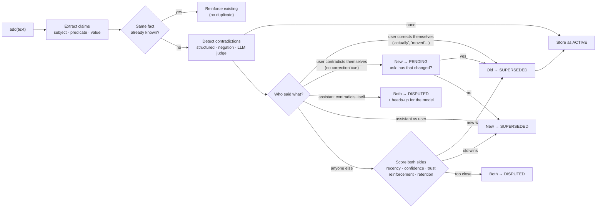
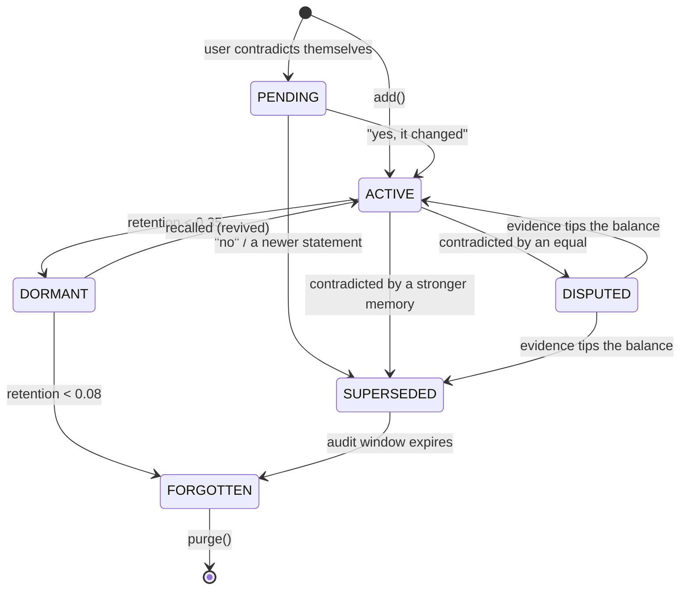
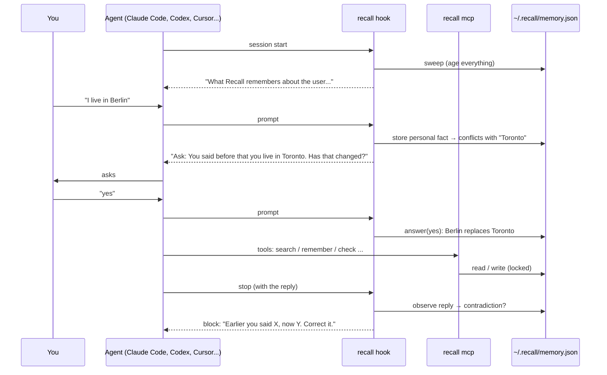

<p align="center">
  
</p>

<p align="center">
  <a href="#install"></a>
  
  
  <a href="#use-it-in-your-ai-tools"></a>
  
  <a href="LICENSE"></a>
</p>

<h3 align="center">Most AI memory only ever grows. Recall decides what to keep.</h3>

<p align="center">
  It <b>ages</b> information on a forgetting curve, <b>asks before it overwrites</b> anything you told it,<br>
  <b>catches contradictions</b> (including the AI contradicting <i>itself</i>), and <b>curates</b> what your model should believe right now.<br>
  One memory, shared by Claude Code, Codex, Gemini, Cursor, Copilot and nine more.
</p>

<p align="center">
  <a href="#install">Install</a> ·
  <a href="#see-it-work">Demo</a> ·
  <a href="#use-it-in-your-ai-tools">AI tools</a> ·
  <a href="#commands">Commands</a> ·
  <a href="#has-that-changed">"Has that changed?"</a> ·
  <a href="#when-the-ai-contradicts-itself">Self-contradictions</a> ·
  <a href="#how-it-works">How it works</a> ·
  <a href="#python-api">API</a> ·
  <a href="docs/UNINSTALL.md">Uninstall</a>
</p>

---

## Why Recall

Vector-store "memory" is an append-only pile. A year in, your assistant confidently believes you
**live in Toronto** *and* **live in Berlin**, still remembers a grocery reminder from March, treats a
random web scrape as gospel, and happily tells you the database port is 5432 an hour after it told
you 6543.

Humans don't work like that. We forget on purpose: unused things fade, rehearsed things stick, and
when someone contradicts what they told us before, we *ask*. Recall gives your agents the same hygiene.

|  | Append-only memory | **Recall** |
|---|---|---|
| Old facts | Live forever | Decay on a per-kind forgetting curve |
| "I live in Toronto" … later "I live in Berlin" | Both retrieved, model guesses | **Asks you:** *"You said before that you live in Toronto. Has that changed?"* (or auto-yes, your choice) |
| "Actually, I moved to Berlin" | Both retrieved | Old belief **superseded** at once, with an audit trail |
| A web page says you live in Paris | Last write wins | Newcomer **rejected**: a weak source can't overrule you |
| The AI said port 5432, now says 6543 | Nobody notices | **Flagged**; the model is told to correct itself |
| The AI says "since you live in Toronto…" after you moved | Nobody notices | **Caught**, and the AI can never overwrite what you said |
| Used often | Same as never used | Gets stronger every time it's recalled |
| "What should the LLM see?" | Top-k by similarity | Current, trusted, relevant, **inside a token budget** |
| "Why does it believe that?" | ¯\\_(ツ)_/¯ | `recall explain <id>` shows the full history |
| Which tools? | One | **14 agents share one memory**: tell Claude Code you moved, and Codex knows tomorrow |

## Install

```bash
pipx install git+https://github.com/unseenanomaly/recall    # or: pip install git+https://github.com/unseenanomaly/recall
recall install --detected                         # connect every AI tool found on this machine
```

That's it. Restart your agents. `recall agents` shows what's connected, `recall doctor` checks the
setup, and [`recall uninstall --all`](docs/UNINSTALL.md) removes every trace.

Want only one tool? `recall install claude-code` (or `codex`, `cursor`, … see [the list](#use-it-in-your-ai-tools)).
Prefer to see what will change first? Add `--dry-run`.

<details>
<summary><b>From a clone / for development</b></summary>

```bash
git clone https://github.com/unseenanomaly/recall && cd recall
pip install -e ".[dev]"      # zero runtime dependencies; pytest for development
pytest                       # 102 tests
recall demo
```
</details>

## See it work

```bash
recall demo
```

A 16-month story plays out on a simulated clock. Highlights, straight from the real output:

```text
━━ Day 120: the user changes their mind ━━━━━━━━━━━━━━━━━━━━━━━━━━
 2025-05-06  + “I moved to Berlin”
              ├ claim    user.lives_in = Berlin
              └ ⟳ SUPERSEDES old belief «Lives in Toronto»
                new memory won on recency + explicit correction (1.10 vs 0.62)
 2025-05-06  + “My favorite editor is VS Code”
              ├ claim    user.favorite_editor = VS Code
              └ ? ASKS FIRST You said before that your favorite editor is vim (2025-01-06). Has that changed?
 2025-05-06  ↳ user: “yes”  →  ✓ confirmed «My favorite editor is vim» replaced
              (with confirm=auto, `recall auto on`, it would have been accepted without asking)

━━ Day 130: an untrustworthy source tries to rewrite history ━━━━━
 2025-05-16  + “I live in Paris” via web
              └ 🛡 REJECTED, old belief holds «I moved to Berlin»
                old memory won on explicit correction + source trust (0.64 vs 0.99)

━━ Day 150: the assistant contradicts itself ━━━━━━━━━━━━━━━━━━━━━
 2025-06-05  ✦ assistant: “The staging database port is 5432.”
              └ consistent; its claims are kept to check later replies against
 2025-06-05  ✦ assistant: “The staging database port is 6543.”
              └ ⚠ SELF-CONTRADICTION
                Earlier (2025-06-05) you said "The staging database port is 5432", but just now
                you said "The staging database port is 6543". Those contradict each other.
 2025-06-05  ✦ assistant: “You live in Toronto, so the 9am standup is early for you.”
              └ ⚠ CONTRADICTS THE USER
                You said "You live in Toronto, ...", but on 2025-05-06 the user told you: "I moved to Berlin".
 2025-06-05  ✦ assistant: “Correction: the staging database port is 5432.”
              └ ✓ it said which one was right, so the dispute is settled
```

…and a year of silence later, the stale and never-used facts have faded, the pinned allergy hasn't,
and Berlin is still at 86% because it kept being *used*. Full output: [`docs/demo-output.txt`](docs/demo-output.txt).

---

## Use it in your AI tools

One command per tool. Every install is **reversible** (`recall uninstall <tool>` removes exactly what
was added, nothing else) and **non-destructive**: Recall merges into your existing config files,
backs each one up once as `<file>.recall-backup`, and refuses to rewrite files that contain comments
(it prints the snippet to paste instead).

| Tool | Install | MCP tools | Hooks (automatic) | Slash commands | Skill |
|---|---|:-:|:-:|---|:-:|
| **Claude Code** | `recall install claude-code` | ✅ | ✅ start · prompt · stop | `/recall:remember` … | — |
| **OpenAI Codex CLI** | `recall install codex` | ✅ | ✅ start · prompt · stop | `$recall remember` … | ✅ |
| **Gemini CLI** | `recall install gemini-cli` | ✅ | ✅ start · prompt · stop | `/recall:remember` … | — |
| **Gemini Code Assist** (IDE agent) | `recall install gemini` | ✅ | — | ask in chat | — |
| **Cursor** (IDE + `cursor-agent`) | `recall install cursor` | ✅ | ✅ start · prompt · reply · stop | `/recall-remember` … | ✅ |
| **GitHub Copilot CLI** | `recall install copilot` | ✅ | ✅ start · prompt · stop | ask in chat | ✅ |
| **Pi** | `recall install pi` | — | ✅ every turn (extension) | `/recall-remember` … | — |
| **OpenCode** | `recall install opencode` | ✅ | ✅ every turn (plugin) | `/recall-remember` … | ✅ |
| **Antigravity CLI** (`agy`) | `recall install antigravity` | ✅ | ✅ stop | `/recall remember` … | ✅ |
| **Hermes Agent** | `recall install hermes` | optional | ✅ every turn (plugin) | `/recall-remember` … | ✅ |
| **Swival** | `recall install swival` | ✅ | — | `!recall-remember` … | ✅ |
| **OpenClaw** | `recall install openclaw` | ✅ | ✅ every turn (plugin) | `/recall remember` … | ✅ |
| **Devin CLI** | `recall install devin` | ✅ | ✅ start · prompt · stop | `/recall remember` … | ✅ |
| **Grok Build** | `recall install grok` | ✅ | ✅ start · prompt · stop | `/recall remember` … | ✅ |

**What the pieces do**

- **MCP tools** (`remember`, `search`, `context`, `answer`, `check`, `forget`, `explain`, `settings`) let the
  model read and write memory itself. The server is built in: `recall mcp`, no dependencies.
- **Hooks** make it automatic. At session start the agent is told what Recall believes about you; when
  you send a prompt, personal facts in it are remembered, a pending *"has that changed?"* question
  is put to you, and a plain "yes"/"no" reply is recorded; when the agent finishes, its reply is
  checked for contradictions and, if it contradicted itself or you, it's asked to fix that.
- **Slash commands** let *you* drive it: remember, search, forget, show, auto-yes on/off, check.
- **The skill** (`SKILL.md`) teaches skill-based agents when and how to use Recall. In most of
  them it doubles as the `/recall` command.

> Every tool shares one memory file, `~/.recall/memory.json`. Run `recall init` inside a project to
> give that project its own memory instead (see [Where your data lives](#where-your-data-lives)).

### Per-tool setup

Each section shows the one-line install, exactly what it writes, how to do it by hand, and how to
check it worked. Paths are for macOS/Linux; on Windows `~` is `%USERPROFILE%`.

<details>
<summary><b>Claude Code</b>: plugin with MCP, hooks and <code>/recall:*</code> commands</summary>

```bash
recall install claude-code
```

Writes a plugin to `~/.claude/skills/recall/` (Claude Code loads plugin folders saved there as
*skills-directory plugins*; honours `CLAUDE_CONFIG_DIR`):

| File | Purpose |
|---|---|
| `.claude-plugin/plugin.json` | plugin manifest |
| `.mcp.json` | the `recall` MCP server |
| `hooks/hooks.json` | `SessionStart`, `UserPromptSubmit`, `Stop` → `recall hook … --agent claude-code` |
| `commands/*.md` | `/recall:remember`, `/recall:search`, `/recall:forget`, `/recall:show`, `/recall:auto`, `/recall:check` |

**Or install from GitHub** (this repo is a plugin marketplace; `recall` must be on your PATH):

```text
/plugin marketplace add unseenanomaly/recall
/plugin install recall@recall
```

**MCP only, by hand:** `claude mcp add --scope user recall -- recall mcp`

**Check:** `/plugin` lists `recall`, `/mcp` shows the server, `/hooks` shows three Recall hooks.
</details>

<details>
<summary><b>OpenAI Codex CLI</b>: MCP, hooks and the <code>$recall</code> skill</summary>

```bash
recall install codex
```

| Where | What |
|---|---|
| `~/.codex/config.toml` | a fenced `[mcp_servers.recall]` block |
| `~/.codex/hooks.json` | `SessionStart`, `UserPromptSubmit`, `Stop` hooks (merged with yours) |
| `~/.agents/skills/recall/SKILL.md` | the skill: `$recall remember …`, or pick it from `/skills` |

Honours `CODEX_HOME`. **One-time step:** Codex asks you to trust new hooks; run `/hooks` in Codex and
trust the three Recall hooks. If your Codex is old enough that hooks are still behind a feature flag,
also add `[features] codex_hooks = true` to `config.toml`.

**MCP only, by hand:** `codex mcp add recall -- recall mcp`

**Check:** `/mcp` lists `recall`; `/hooks` shows the hooks; `$recall show` prints your memory.
</details>

<details>
<summary><b>Gemini CLI</b>: extension with MCP, hooks, context and <code>/recall:*</code> commands</summary>

```bash
recall install gemini-cli
```

Writes an extension to `~/.gemini/extensions/recall/`:

| File | Purpose |
|---|---|
| `gemini-extension.json` | manifest + the `recall` MCP server |
| `GEMINI.md` | short instructions loaded as context |
| `hooks/hooks.json` | `SessionStart`, `BeforeAgent`, `AfterAgent` hooks |
| `commands/recall/*.toml` | `/recall:remember`, `/recall:search`, `/recall:forget`, `/recall:show`, `/recall:auto`, `/recall:check` |

**From a clone instead:** `gemini extensions link ./integrations/gemini-cli`

**MCP only, by hand:** `gemini mcp add -s user recall recall mcp`

**Check:** `gemini extensions list`, then `/mcp` and `/hooks` inside Gemini CLI. Older Gemini CLI
versions need hooks switched on in `~/.gemini/settings.json`.
</details>

<details>
<summary><b>Gemini Code Assist</b> (VS Code / JetBrains agent mode): MCP and instructions</summary>

```bash
recall install gemini
```

| Where | What |
|---|---|
| `~/.gemini/settings.json` | `mcpServers.recall` |
| `~/.gemini/GEMINI.md` | a fenced instructions block |

Agent mode has no hooks or custom commands, so just talk to it: *"remember that I'm vegetarian"*,
*"what do you remember about my setup?"*, *"turn Recall's auto-yes on"*. Reload the IDE window after installing.
</details>

<details>
<summary><b>Cursor</b> (editor agent and <code>cursor-agent</code> CLI): MCP, hooks, commands, skill</summary>

```bash
recall install cursor
```

| Where | What |
|---|---|
| `~/.cursor/mcp.json` | `mcpServers.recall` (the editor and the CLI share it) |
| `~/.cursor/hooks.json` | `sessionStart`, `beforeSubmitPrompt`, `afterAgentResponse`, `stop` |
| `~/.cursor/commands/recall-*.md` | `/recall-remember`, `/recall-search`, `/recall-forget`, `/recall-show`, `/recall-auto`, `/recall-check` |
| `~/.cursor/skills/recall/SKILL.md` | the skill |

Cursor's `beforeSubmitPrompt` hook can't add context, so Recall delivers *"has that changed?"* questions
and contradiction notes through the `stop` hook's follow-up message: the agent takes one extra turn
to ask you.

**Check:** Settings → MCP shows `recall`; Settings → Hooks lists the four hooks; type `/recall-show`.
</details>

<details>
<summary><b>GitHub Copilot CLI</b>: MCP, hooks, skill</summary>

```bash
recall install copilot
```

| Where | What |
|---|---|
| `~/.copilot/mcp-config.json` | `mcpServers.recall` (`type: local`, all tools) |
| `~/.copilot/hooks/recall.json` | `sessionStart`, `userPromptSubmitted`, `agentStop` (bash + PowerShell) |
| `~/.copilot/skills/recall/SKILL.md` | the skill |

Honours `COPILOT_HOME`. The CLI drops `userPromptSubmitted` output, so questions arrive through
`agentStop` (Copilot takes one more turn to ask). Use it by asking: *"recall, remember that I use pnpm"*.

**MCP only, by hand:** run `/mcp add` inside `copilot`.

**Check:** `/mcp` shows `recall`; `/skills` lists `recall`.
</details>

<details>
<summary><b>Pi</b>: extension that runs every turn, plus <code>/recall-*</code> commands</summary>

```bash
recall install pi
```

Writes `~/.pi/agent/extensions/recall.ts` (honours `PI_CODING_AGENT_DIR`). Pi deliberately has no
MCP, so the extension does everything:

- `before_agent_start`: adds what Recall remembers (and any question) to the system prompt
- `agent_end`: checks the reply for contradictions and raises them on the next turn
- commands that run instantly, without the model: `/recall-remember`, `/recall-search`,
  `/recall-forget`, `/recall-show`, `/recall-auto`, `/recall-answer`, `/recall-check`

**From a clone instead:** `pi --extension ./integrations/pi/recall.ts`

**Check:** restart pi, then `/recall-show`.
</details>

<details>
<summary><b>OpenCode</b>: MCP, plugin, commands, skill</summary>

```bash
recall install opencode
```

| Where | What |
|---|---|
| `~/.config/opencode/opencode.json` | `mcp.recall` (`type: local`) |
| `~/.config/opencode/plugins/recall.js` | memory on every message (`chat.message` + system prompt), contradiction check on `session.idle` |
| `~/.config/opencode/commands/recall-*.md` | `/recall-remember`, `/recall-search`, `/recall-forget`, `/recall-show`, `/recall-auto`, `/recall-check` |
| `~/.config/opencode/skills/recall/SKILL.md` | the skill |

If your config is `opencode.jsonc` with comments, Recall prints the `mcp` snippet for you to paste
instead of rewriting the file.

**Check:** `opencode mcp list` shows `recall`; type `/recall-show`.
</details>

<details>
<summary><b>Antigravity CLI</b> (<code>agy</code>): plugin with MCP, stop hook, skill</summary>

```bash
recall install antigravity
```

Writes a plugin to `~/.gemini/config/plugins/recall/` with `plugin.json`, `mcp_config.json`
(the `recall` server), `hooks.json` (a `Stop` hook that checks replies) and `skills/recall/SKILL.md`
(skills surface as slash commands: `/recall remember …`).

Antigravity's hooks don't see your prompt text, so memory comes in through the MCP tools and the
skill rather than per-prompt injection. If `agy plugin list` doesn't show it, run
`agy plugin install ~/.gemini/config/plugins/recall`.
</details>

<details>
<summary><b>Hermes Agent</b>: plugin that runs every turn, commands, skill</summary>

```bash
recall install hermes
```

| Where | What |
|---|---|
| `~/.hermes/plugins/recall/` | `plugin.yaml` + `__init__.py`: `pre_llm_call` adds memory, `post_llm_call` checks the reply, and commands `/recall-remember`, `/recall-search`, `/recall-forget`, `/recall-show`, `/recall-auto`, `/recall-answer` |
| `~/.hermes/skills/recall/SKILL.md` | the skill (`/recall …`) |

Then `hermes plugins enable recall` (the installer runs it for you when `hermes` is on PATH).
Honours `HERMES_HOME`. **Optional MCP tools:** add this to `~/.hermes/config.yaml` and run `/reload-mcp`:

```yaml
mcp_servers:
  recall:
    command: "recall"
    args: ["mcp"]
```
</details>

<details>
<summary><b>Swival</b>: MCP, <code>!recall-*</code> commands, skill, instructions</summary>

```bash
recall install swival
```

| Where | What |
|---|---|
| `~/.config/swival/config.toml` | a fenced `[mcp_servers.recall]` block |
| `~/.config/swival/AGENTS.md` | a fenced instructions block (use Recall each task) |
| `~/.config/swival/commands/recall-*.md` | `!recall-remember`, `!recall-search`, `!recall-forget`, `!recall-show`, `!recall-auto`, `!recall-check` |
| `~/.config/swival/skills/recall/SKILL.md` | the skill (`$recall …`) |

Swival's lifecycle hooks only run at startup and exit, so it relies on the instructions + MCP
tools rather than per-turn hooks. Honours `XDG_CONFIG_HOME`.
</details>

<details>
<summary><b>OpenClaw</b>: MCP, plugin, skill</summary>

```bash
recall install openclaw
```

| Where | What |
|---|---|
| `~/.openclaw/openclaw.json` | `mcp.servers.recall` |
| `~/.openclaw/extensions/recall/` | plugin: `before_prompt_build` adds memory, `agent_end` checks replies |
| `~/.openclaw/skills/recall/SKILL.md` | the skill (`/recall …` or `/skill recall …`) |

The installer runs `openclaw plugins enable recall` when `openclaw` is on PATH. For the reply check,
allow the plugin to read conversations: set `plugins.entries.recall.hooks.allowConversationAccess`
to `true`. OpenClaw's plugin API is marked experimental upstream; the MCP tools and skill work
regardless. If `openclaw.json` contains comments, Recall prints the snippet to paste instead.
</details>

<details>
<summary><b>Devin CLI</b>: MCP, hooks, skill</summary>

```bash
recall install devin
```

| Where | What |
|---|---|
| `~/.config/devin/mcp_config.json` | `mcpServers.recall` (`%APPDATA%\devin\` on Windows) |
| `~/.config/devin/config.json` | `SessionStart`, `UserPromptSubmit`, `Stop` hooks under `hooks` |
| `~/.config/devin/skills/recall/SKILL.md` | the skill (`/recall …`) |

**MCP only, by hand:** `devin mcp add -s user recall -- recall mcp`
</details>

<details>
<summary><b>Grok Build</b>: MCP, hooks, skill</summary>

```bash
recall install grok
```

| Where | What |
|---|---|
| `~/.grok/config.toml` | a fenced `[mcp_servers.recall]` block |
| `~/.grok/hooks/recall.json` | `SessionStart`, `UserPromptSubmit`, `Stop` hooks |
| `~/.grok/skills/recall/SKILL.md` | the skill (`/recall …`) |

Honours `GROK_HOME`. **MCP only, by hand:** add the `[mcp_servers.recall]` table to
`~/.grok/config.toml` yourself, or use `grok mcp add`. Grok Build also reads Claude Code's and
Cursor's hook files; if you notice Recall's hooks running twice, keep only one of those installs.
</details>

<details>
<summary><b>Anything else that speaks MCP</b></summary>

Point it at the server:

```json
{ "mcpServers": { "recall": { "command": "recall", "args": ["mcp"] } } }
```

Or call the CLI from your own hooks: `recall hook prompt --agent generic --text "<prompt>"` prints
`{"context": "..."}` to inject, and `recall hook stop --agent generic --text "<reply>"` prints
`{"followup": "..."}` when the reply contradicted something. `recall export-integrations <dir>`
writes every file above to a folder you can copy from; they're also checked in under
[`integrations/`](integrations/).
</details>

---

## Commands

The same six verbs everywhere; only the spelling changes.

| What | Claude Code · Gemini CLI | Cursor · OpenCode · Pi · Hermes | Swival | Skill agents¹ | CLI |
|---|---|---|---|---|---|
| Save something | `/recall:remember <fact>` | `/recall-remember <fact>` | `!recall-remember` | `/recall remember <fact>` | `recall add "<fact>"` |
| What do you know about… | `/recall:search <topic>` | `/recall-search <topic>` | `!recall-search` | `/recall search <topic>` | `recall ask "<topic>"` |
| Forget something | `/recall:forget <thing>` | `/recall-forget <thing>` | `!recall-forget` | `/recall forget <thing>` | `recall forget "<thing or id>"` |
| Show everything | `/recall:show` | `/recall-show` | `!recall-show` | `/recall show` | `recall context` |
| Auto-yes on / off | `/recall:auto on` | `/recall-auto on` | `!recall-auto on` | `/recall auto on` | `recall auto on` |
| Check the last reply | `/recall:check` | `/recall-check` | `!recall-check` | `/recall check` | `recall check "<text>"` |

¹ Antigravity, Devin, Grok Build, OpenClaw (`/recall …`), Codex (`$recall …`). In Copilot CLI and
Gemini Code Assist just ask: *"recall, remember that…"*. Pi and Hermes also have `/recall-answer yes|no`.

---

## "Has that changed?"

Recall never silently throws away something **you** said, and never silently overwrites it either.

| You say… | Recall does |
|---|---|
| "I live in Toronto" … later "**Actually**, I moved to Berlin" | Replaces Toronto right away. "actually", "moved", "no longer", "I was wrong"… are explicit corrections. |
| "I live in Toronto" … later "I live in Berlin" | Keeps believing Toronto for now and asks: **"You said before that you live in Toronto (2025-01-06). Has that changed?"** |
| …you answer "yes" | Berlin replaces Toronto, with an audit trail. |
| …you answer "no" | Toronto stays (and gets *more* trusted); the Berlin statement is set aside. |
| …you never answer | After 7 days the newer statement wins (configurable). |
| A web page / tool says something different | Your word wins without asking. A weaker source can't overrule you. |

In agents with hooks, the question shows up in the conversation automatically and a plain
"yes"/"no" reply is recorded for you. Elsewhere the model asks it after `remember` and records the
answer with the `answer` tool (or `recall answer yes`).

### Turn the questions off (auto-yes)

```bash
recall auto on          # never ask; the newest thing you say wins
recall auto off         # ask again (the default)
recall auto             # show the current setting
```

…or from any agent: `/recall:auto on`, `/recall-auto on`, *"turn Recall's auto-yes on"*. Same thing
as `recall config set confirm auto`, or `RECALL_CONFIRM=auto` for one shell. In Python:
`Recall(config=Config(confirm_changes="auto"))`.

## When the AI contradicts itself

Recall holds the assistant to what it said before, and to what you told it.

- **Self-contradictions.** Every reply is read for flat assertions ("the staging port is 5432").
  If a later reply says otherwise ("…is 6543") without flagging it as a correction, both statements
  are marked *disputed* and the model is told: *"Earlier you said X, but just now you said Y. Tell the
  user which is right."* In agents with stop hooks it fixes this before handing the turn back;
  elsewhere it's raised at the start of the next turn.
- **Contradicting you.** *"Since you live in Toronto…"* after you said you moved gets caught the same
  way, and the AI can never overwrite what you said.
- **Corrections are welcome.** "Correction: it's 5432" or "I was wrong earlier…" updates the record
  and settles the dispute. Honest corrections aren't contradictions.
- **Low noise.** Questions, hedged or conditional sentences ("this *might* be…", "*if* the port is…"),
  code blocks, quoting what you said, and conversational phrases ("the problem is…") are ignored.
  The model's guesses about *you* are checked but never stored: a hallucination can't become a memory.
- **Testimony, not truth.** What the assistant asserted fades faster (30-day half-life) and isn't
  fed back into its own context, so it can't bootstrap its own mistakes.

Dry-run a draft any time: `recall check "The staging port is 6543."` (exits 1 on a contradiction),
or the MCP `check` tool. Switch the behaviour with `recall config set self_check newest` (newest
statement quietly wins) or `off`.

---

## Python API

```python
from recall import Recall

mem = Recall()                                   # in-memory; use JSONStore("memory.json") to persist

mem.add("I live in Toronto and work at Shopify") # split into two atomic memories
mem.add("I'm allergic to peanuts", pinned=True)  # pinned = never forgotten

res = mem.add("I live in Berlin")                # contradicts the user's own earlier statement
res.question.text   # -> "You said before that you live in Toronto (2025-01-06). Has that changed?"
mem.answer(res.question.id, yes=True)            # Berlin replaces Toronto

mem.add("Actually I moved to Lisbon")            # explicit correction: replaces without asking

check = mem.observe("The staging port is 5432.") # hold the model to what it says...
check = mem.observe("The staging port is 6543.") # ...and catch it changing its story
check.message()     # -> "Recall found 1 contradiction(s) in your last reply: ..."

mem.recall("where does the user live?")          # retrieval is rehearsal: hits get stronger
print(mem.active_context(token_budget=300).to_prompt())
```

```text
## What I currently know about the user
- Works at Shopify  [as of 2025-01-06]
- I'm allergic to peanuts  [as of 2025-01-06]
- Actually I moved to Lisbon  [as of 2025-01-06]
```

Paste that block into your system prompt. Superseded beliefs never appear; disputed ones appear
tagged `(unverified: conflicting evidence)`; open questions appear under *"Ask the user before
relying on this"*; heads-ups about contradictions appear under *"Heads-up from Recall"*.

Drop it into an agent loop ([`examples/agent_loop.py`](examples/agent_loop.py)):

```python
def chat(user_message):
    if not user_message.rstrip().endswith("?"):
        memory.add(user_message)                         # contradictions resolved, or asked about
    ctx = memory.active_context(token_budget=300, reinforce=True)
    reply = llm(system="You are helpful.\n" + ctx.to_prompt(), user=user_message)
    if (check := memory.observe(reply)).conflicts:       # the model contradicted itself or the user
        reply = llm(system=check.message(), user="Please correct your last answer.")
    return reply
```

### Reference

```python
from recall import Recall, JSONStore, SystemClock, ManualClock, Config, Kind, Status

mem = Recall(
    store=JSONStore("memory.json"),   # any Store subclass
    clock=SystemClock(),              # ManualClock() to simulate time
    config=Config(),                  # every threshold, weight and policy
    detectors=None,                   # default: Structured + Negation
    extractor=None,                   # default: built-in rule-based claim extractor
    relevance_fn=None,                # (query, memory) -> 0..1, e.g. embeddings
    on_event=None,                    # (event, memory, detail) hook
)
```

| Method | What it does |
|---|---|
| `add(text, *, kind, importance, confidence, source, source_trust, pinned, claims, tags, metadata, correction)` | Ingest. Returns `AddResult` (`.memory`, `.contradictions`, `.resolutions`, `.superseded`, `.rejected`, `.disputed`, `.pending`, `.questions`, `.question`, `.merged`) |
| `questions()` · `answer(id, yes=True)` | Open "has that changed?" questions, and settling one |
| `observe(text)` · `check(text)` | Hold assistant text to what was said before. `observe` also remembers its claims; `check` is a dry run. Both return `CheckResult` (`.ok`, `.conflicts`, `.self_contradictions`, `.message()`) |
| `recall(query, *, limit, token_budget, reinforce)` | Ranked `Hit`s (`.memory`, `.relevance`, `.retention`, `.score`). Hits are reinforced |
| `active_context(query=None, *, token_budget, limit, reinforce, include_questions, include_notices)` | The prompt-ready working set → `ContextPack.to_prompt()` |
| `notify(text)` · `notices()` · `clear_notices()` | Heads-ups queued for the model's next context |
| `sweep()` | Age everything: fade, forget, expire the superseded, settle disputes, time out questions |
| `purge()` | Permanently delete forgotten tombstones |
| `reinforce(id)` · `pin(id)` · `forget(id)` · `resolve_dispute(winner_id)` | Manual control |
| `explain(id)` · `stats()` · `memories(*statuses)` · `retention_of(id)` | Introspection |

---

## How it works



### 1. Memories have a lifecycle



| State | Meaning | Served to the model? |
|---|---|---|
| `ACTIVE` | Believed and strong | ✅ |
| `DORMANT` | Faded, but still believed | Only when relevant to the query |
| `DISPUTED` | Credible conflicting evidence | ✅ flagged *unverified* |
| `PENDING` | You said something new; waiting for "has that changed?" | ❌ (the question is served instead) |
| `SUPERSEDED` | Replaced by newer/stronger knowledge | ❌ (kept for audit and undo) |
| `FORGOTTEN` | Decayed away | ❌ (tombstone until `purge()`) |

### 2. The forgetting curve

Retention decays exponentially with a **per-memory half-life**:

```
R(t) = 0.5 ^ (t / H)          H₀ = base_half_life[kind] × (0.5 + 1.5 × importance)
```

| Kind | Base half-life | Example |
|---|---|---|
| `IDENTITY` | 730 days | where you live, your name |
| `FACT` | 180 days | employer, diet |
| `PREFERENCE` | 120 days | favourite editor, likes |
| `EVENT` | 30 days | "met with the client" |
| `EPHEMERAL` | 3 days | "remind me tomorrow" |

Assistant claims are capped at 30 days. Kind is inferred automatically (or pass `kind=`).
**Retrieval is rehearsal**: every successful recall grows the half-life, and grows it *more* when
the memory was about to be forgotten (the spaced-repetition "desirable difficulty" effect):

```
H' = H × (1.4 + 1.0 × (1 − R))
```

So the things your agents actually use become effectively permanent, and the rest quietly dissolve.

### 3. Contradiction detection

Detectors are pluggable and run in order; the defaults need no model at all.

| Detector | Catches | Example |
|---|---|---|
| `StructuredDetector` | Claim-level conflicts on single-valued predicates, and direct negations | `lives_in: Toronto` vs `Berlin` · `likes hiking` vs `doesn't like hiking` |
| `NegationDetector` | Free-text near-duplicates with flipped polarity | "API is rate limited" vs "API is **not** rate limited" |
| `LLMJudgeDetector` | Anything semantic, via *your* model, pre-filtered so you only pay for plausible pairs | "deploy on Fridays" vs "Friday deploy freeze" |

Multi-valued predicates (`likes coffee`, `likes jazz`) coexist peacefully. Compound statements
(*"I work at X and love Y"*) are split into atomic memories, so retracting one part never destroys
the other. Assistant text is read from the other side of the table: *"you live in X"* is a claim
about the user, and the assistant's own *"I…"* isn't.

### 4. Resolution: who wins?

First, **who said it** (the policy layer):

| New statement from | Contradicts | Outcome |
|---|---|---|
| the user, phrased as a correction | anything | new supersedes old |
| the user | something the user said | **ask** (or auto-yes) |
| the user | a weaker source, but scores lose | **ask** (or auto-yes): the user is never silently rejected |
| the assistant | something the user said | assistant's claim rejected |
| the assistant, no correction cue | something the assistant said | both **disputed**, heads-up queued |
| the assistant, "correction: …" | something the assistant said | new supersedes old |

Everything else goes to the **credibility score**, built from five signals plus two bonuses:

| Signal | Weight | Intuition |
|---|---|---|
| Recency | 0.30 | Newer beats older (45-day half-life) |
| Confidence | 0.25 | How sure the memory was when stored |
| Source trust | 0.25 | `user 1.0` › `system` › `tool` › `assistant` › `web 0.45` › `hearsay 0.3` |
| Reinforcement | 0.10 | How often it has been successfully used |
| Retention | 0.10 | How strong it still is on the curve |
| **+ Explicit correction** | +0.15 | "actually", "no longer", "moved", "instead", "I was wrong"… |
| **+ Same-source follow-up** | +0.10 | A later statement from the same source supersedes |

| Margin (new − old) | Outcome |
|---|---|
| `> +0.06` | New **supersedes** old |
| `< −0.06` | New is **rejected**; the incumbent is defended |
| otherwise | Both become **disputed** until evidence tips the balance (`sweep()` re-checks) |

Every decision carries a human-readable reason and lands in the memory's audit trail:

```text
$ recall explain m_84796e41
m_84796e41  "I moved to Berlin"
  status=active  kind=identity  retention=1.00  half-life=2759d  recalled=3x
  claim: user.lives_in = Berlin
  history:
    2025-05-06  created      identity, half-life 912d, source=user (trust 1.00)
    2025-05-06  supersedes   m_248714e9: user.lives_in can only have one value: 'Toronto' vs 'Berlin'
    2025-05-16  defended     held against m_b32701c7 (old memory won on explicit correction + source trust)
    2026-05-31  reinforced   recalled for "where does the user live"; half-life now 2759d
```

### 5. How agents plug in



- **Hooks** are one adapter, `recall hook <event> --agent <name>`, that speaks each agent's JSON
  dialect (Claude-style `additionalContext` and `decision: block`, Gemini's `BeforeAgent`/`AfterAgent`,
  Cursor's `additional_context`/`followup_message`, Copilot's camelCase events, and so on). A hook
  never breaks your agent: errors are logged to `~/.recall/hooks.log` and the agent carries on.
- **Capture is conservative.** Hooks only remember *personal* facts from your prompts on their own
  (where you live, work, diet, allergies, likes, your editor/OS/timezone…), never task chatter like
  "my build is failing". Everything else goes through `/remember` or the `remember` tool. Change it
  with `recall config set capture all|off`.
- **The MCP server** (`recall mcp`) is a dependency-free JSON-RPC server over stdio. It reopens the
  memory file on every call, so it always sees what hooks and other agents just wrote; a small file
  lock keeps concurrent writers from losing each other's updates.

---

## Settings

```bash
recall config                      # show everything
recall config set confirm auto     # same as `recall auto on`
recall config set capture off
recall config set context_budget 600 --project   # only for this project
```

| Setting | Default | Values | Meaning |
|---|---|---|---|
| `confirm` | `ask` | `ask` · `auto` | Ask "has that changed?" or auto-yes |
| `self_check` | `flag` | `flag` · `newest` · `off` | When the AI contradicts itself: flag it, let the newest win, or don't check |
| `capture` | `personal` | `personal` · `all` · `off` | What hooks remember from your prompts on their own |
| `context_budget` | `400` | tokens | Size of the memory block injected at session start |
| `pending_ttl_days` | `7` | days | When an unanswered question settles itself |
| `pending_default` | `yes` | `yes` · `no` | …and which way |

Stored in `~/.recall/config.json`, overridden per project by `./.recall/config.json`, and per shell by
`RECALL_CONFIRM`, `RECALL_SELF_CHECK`, `RECALL_CAPTURE`.

## CLI

```bash
recall add "I live in Toronto and work at Shopify"   # --pin, --source web, --json
recall add "I live in Berlin"                        # ? You said before that you live in Toronto... Has that changed?
recall questions                                     # open questions
recall answer yes                                    # or: recall answer m_1a2b3c4d no
recall ask "where do I live?"                        # --json
recall context --budget 300                          # the prompt block
recall check "The staging port is 6543."             # exit 1 on a contradiction; --store to remember it
recall list --all
recall explain m_84796e41
recall forget "peanuts"                              # by id or description
recall sweep --purge
recall auto on|off                                   # auto-yes for "has that changed?"
recall config [get|set|unset] KEY [VALUE]
recall init                                          # give this project its own memory
recall where                                         # which memory file is in use
recall install <agent...> | --detected | --all       # --dry-run
recall uninstall <agent...> | --all
recall agents                                        # what's supported and installed
recall doctor                                        # check the setup
recall mcp                                           # the MCP server (agents start this)
recall hook <event> --agent <name>                   # agents call this
recall demo
```

## Where your data lives

- **Memory:** `~/.recall/memory.json`, shared by every agent. Inside a folder where you ran
  `recall init`, that project's `./.recall/memory.json` is used instead. `--db` or `RECALL_DB` override
  both; `RECALL_HOME` moves `~/.recall`. `recall where` tells you which file is active.
- **Plain JSON**, human-readable and git-diffable. Nothing leaves your machine: Recall makes no network
  calls. (Your agent of course sends whatever context it's given to its model provider.)
- **Never store secrets.** The skill and MCP instructions tell models not to; `recall forget` and
  `recall sweep --purge` clean up, and `recall forget-all --yes` deletes the file.
- Add `.recall/` to `.gitignore` in projects unless you mean to share the memory.

## Uninstall

```bash
recall uninstall --all       # every agent; your memory file is kept
recall forget-all --yes      # delete the memory itself
pipx uninstall recall-memory # remove the program
```

Per-tool commands, exactly what each one removes, and how to do it by hand:
**[docs/UNINSTALL.md](docs/UNINSTALL.md)**.

## Troubleshooting

| Symptom | Fix |
|---|---|
| Agent says it can't find `recall` | Re-run `recall install <agent>`: it writes the absolute path of the `recall` you're running now. `--launcher "recall"` forces the bare name. |
| Hooks don't seem to run | `recall doctor`, then check `~/.recall/hooks.log`. Codex needs a one-time `/hooks` trust; older Gemini CLI needs hooks enabled. |
| "contains comments, which an automatic edit would erase" | Recall won't rewrite a commented JSON file; paste the snippet it printed. |
| Too many questions | `recall auto on`. |
| A false "contradiction" | Say "correction: …" to settle it, `recall forget <id>`, or `recall config set self_check off`. Please open an issue with the sentence! |
| Windows: paths with spaces | Recall quotes them, but if a tool's shell mangles quotes, pass `--launcher` with a space-free path. |

---

## Extending Recall

Everything is behind a small seam, and the core has no dependencies:

| Seam | Plug in |
|---|---|
| `relevance_fn(query, memory) -> float` | Embeddings, a reranker, a vector DB |
| `detectors=[...]` | `LLMJudgeDetector(your_model_call)`, or anything with `.detect(new, existing)` |
| `extractor(text, subject=..., speaker=...) -> [Claim]` | An LLM-based claim extractor |
| `Store` subclass | SQLite, Postgres, Redis (five methods: `put get delete all flush`) |
| `Config` | Half-lives, thresholds, scoring weights, source trust, ask/auto, self-check |
| `on_event` | Metrics, logging, cold-storage archival when a memory is forgotten |
| `recall hook --agent generic` | Wire any agent with a hook system in a few lines |

```python
from recall import Recall, LLMJudgeDetector, StructuredDetector, NegationDetector

def judge(new_text, old_text):                # call any model here
    return (True, "incompatible policies")    # -> (is_contradiction, explanation)

mem = Recall(detectors=[StructuredDetector(), NegationDetector(), LLMJudgeDetector(judge)])
```

See [`examples/`](examples/) for a quickstart, an agent loop, the LLM-judge setup, and self-checking.

## Project layout

```
src/recall/
├── engine.py         # Recall: add / questions / observe / recall / sweep / explain
├── decay.py          # forgetting curve + spaced-repetition reinforcement
├── claims.py         # rule-based claim extraction, speakers, kind inference
├── contradiction.py  # Structured / Negation / LLM-judge detectors
├── resolver.py       # credibility scoring and verdicts
├── retrieval.py      # dependency-free IDF retrieval
├── store.py          # in-memory and JSON stores, file lock
├── settings.py       # where memory lives, saved settings
├── hooks.py          # `recall hook`: one adapter, every agent's dialect
├── mcp.py            # `recall mcp`: zero-dependency MCP server
├── integrations/     # `recall install`: per-agent plans, templates, shared content
├── clock.py · config.py · demo.py · cli.py
integrations/         # generated, ready-to-copy files for every agent (+ Claude Code marketplace)
tests/                # 102 tests, each a short "add → advance time → assert" story
```

Time is injected everywhere, so you can fast-forward a year in a unit test.

## Honest limitations

Recall is a young project. Know what it does and doesn't do:

- **The built-in claim extractor is rule-based and English-only.** It recognises common
  first-person patterns ("I live in…", "my X is Y", "the X is Y", likes/dislikes). For anything
  richer, pass an LLM extractor or a `LLMJudgeDetector`. Self-contradiction checks inherit this:
  "the port is 5432" vs "the port is 6543" is caught; paraphrases need the LLM judge.
- **Assistant checks are heuristics.** Hedged, conditional and conversational sentences are skipped to
  keep false alarms rare, which also means some real contradictions slip through.
- **Default retrieval is lexical.** It cannot link "weekend plans" to "lives in Berlin". Use
  `active_context()` without a query for personalization, or supply `relevance_fn` with embeddings.
- **Agent integrations follow each tool's documented config as of October 2026.** These tools move fast.
  Where a tool can't inject context on every prompt (Cursor, Copilot CLI, Antigravity, Swival), Recall
  falls back to stop-hook follow-ups, MCP tools and instructions. The OpenClaw plugin API is upstream-experimental.
- **Scores are heuristics, not truth.** The weights are sensible defaults you should tune, and
  every verdict is explained so you can see when they're wrong.
- **`JSONStore` is single-file.** A lock serialises writers across processes; fine for personal use
  across many agents, use a database `Store` for scale.
- Forgetting is a product decision. Pin anything that must never fade (allergies, safety rules).

## Roadmap

- [ ] SQLite store with indexed lookups
- [ ] Embedding `relevance_fn` adapters
- [ ] Project-scope installs (`recall install --project`)
- [ ] Temporal claims (valid-from / valid-until) and "used to" history queries
- [ ] Consolidation: merge many episodic memories into one summary memory
- [ ] Benchmarks on a public contradiction-in-memory dataset
- [ ] Multi-language claim patterns

## Contributing

PRs welcome. See [CONTRIBUTING.md](CONTRIBUTING.md). The tests are the best documentation:
`pytest` and `recall demo` are all you need.

## License

[MIT](LICENSE)

<p align="center"><br><sub>Remember what matters. Forget the rest. Ask when it changes.</sub></p>
